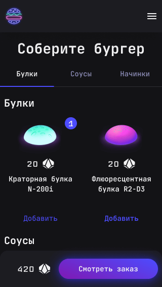
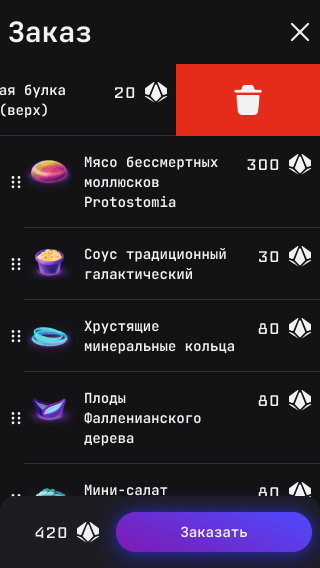
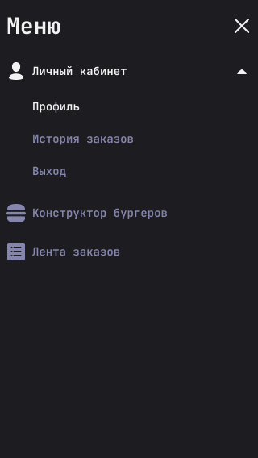

# Stellar Burgers

## Cсылка на проект https://kargobober.github.io/kargoburger/

  
  
  

## Функционал
* Создание заказов двойным кликом или перетаскиванием ([Drag and Drop](https://github.com/react-dnd/react-dnd))
* Одинарный клик по ингредиенту вызывает модальное окно\
  с подробной информацией (происходит навигация на маршрут ингредиента)
* При переходе по ссылке на маршрут ингредиента с постороннего сайта\
  открывается отдельная страница без модального окна (работа с историей браузера)
* Порядок ингредиентов в конструкторе можно изменять (Drag and Drop)
* На сенсорных устройствах можно удалять ингредиенты свайпом
* Авторизация пользователей (localStorage, access&refresh токены, личный кабинет,\
  восстановление пароля, fetch with refresh в случае "jwt expired" автоматически обновляет токен)
* Просмотр истории глобальных и личных заказов (на WebSocket)
* Отзывчивый интерфейс уведомляет пользователя о статусе его запросов ([react-hot-toast](https://github.com/timolins/react-hot-toast))
* Возможность попробовать бессмертного моллюска👾👾👾

## Стек:
* React
* Redux & Redux Toolkit
* React router
* Typescript (в т.ч. дженерики) 
 
* WebSocket
* LocalStorage
* Jest
* Cypress 
 
* React DnD (с поддержкой touch-событий)
* Адаптивная вёрстка на flex и grid
* Pixel Perfect
* Figma (ссылка на [макет проекта](https://www.figma.com/file/tLatiSwpQmOsE3nSReMmqN/React_Bootcamp_Проектные-задачи_external_link?type=design&node-id=0-1&mode=design), разбит на листы)
* HTML5
* CSS3 & CSS-modules

## Известные проблемы
* Блокировщики рекламы могут быть причиной разрыва WebSocket-соединения\
на страницах глобальных/персональных заказов. Для решения проблемы отключите\
работу блокировщика на домене проекта (добавьте в белый список).
